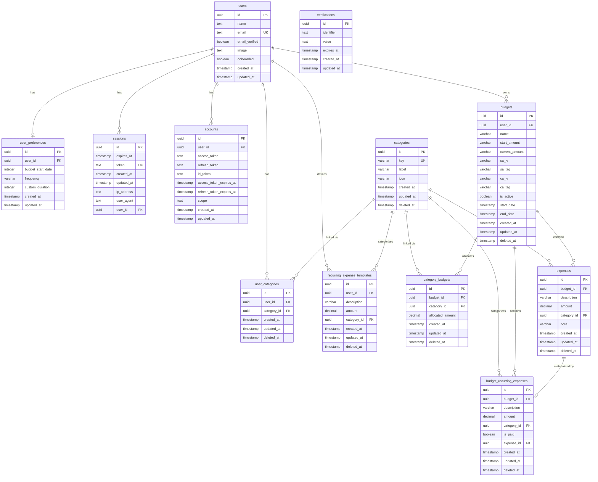
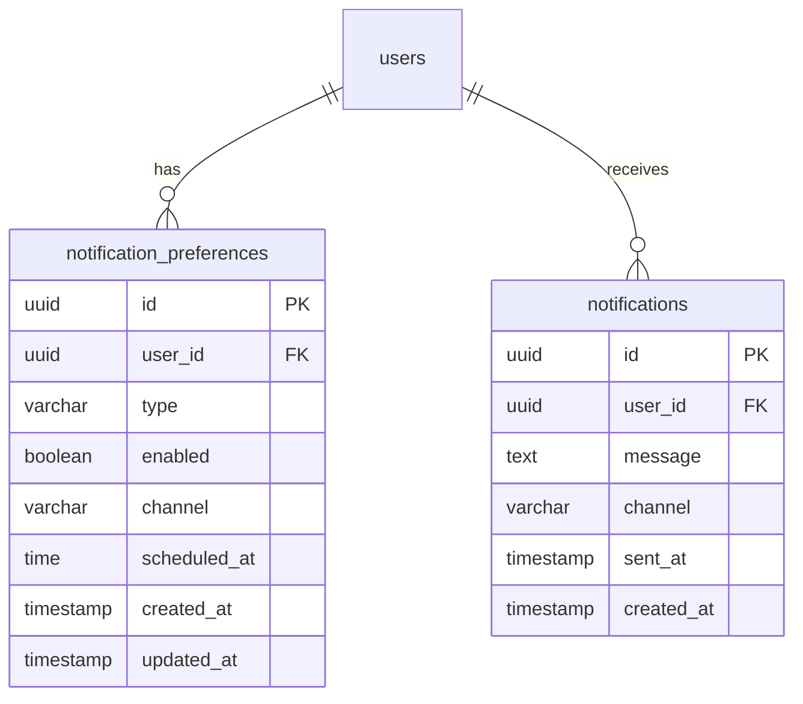

# Entity Relationship Diagram

Generated from `back-end/src/lib/db/schema.ts`.

## Notifications

## Notes

- `user_categories` and `category_budgets` are junction tables. `user_categories` has a unique constraint on `(user_id, category_id)`.
- `recurring_expense_templates` are user-level definitions; `budget_recurring_expenses` are per-budget snapshots that optionally link to a materialized `expense` once paid (`expense_id` is `set null` on delete).
- `verifications` has no foreign keys and stands alone.
- All domain tables use soft deletes via `deleted_at`. Auth-related tables (`sessions`, `accounts`, `verifications`) do not.
- `recurring_expense_templates` enforces a partial unique index on `(user_id, description)` where `deleted_at IS NULL`.
